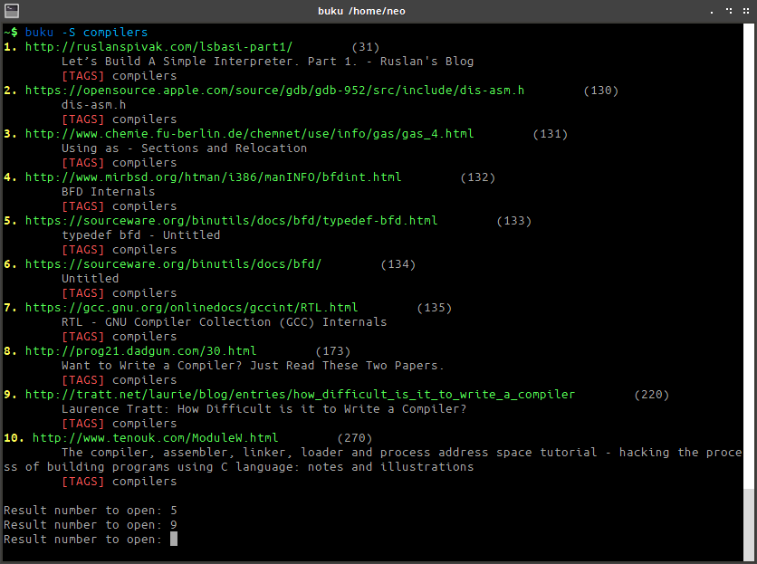

# Buku

`buku` (formerly `markit`) is a cmdline bookmark management utility written in Python3 and SQLite3. `buku` exists because of my monumental dependency on <a href="http://historio.us/">historious</a>. I wanted the same database on my local system. However, I couldn't find an equally flexible cmdline solution. Hence, `Buku`!  
  
The SQLite3 database file is stored in `$HOME/.cache/buku/bookmarks.db` for each user.  
  
`buku` is GPLv3 licensed.

Changed the original project name to my son's nickname due to a possible copyright conflict.

If you find `buku` useful, please consider donating via PayPal.  

# Features
- Add, update or remove a bookmark
- Add tags to bookmarks
- Manual password protection using AES256 encryption algorithm
- Optionally fetch page title data from the web (default: disabled)
- Use (partial) tags or keywords to search bookmarks
- Any or all search keyword match options
- Unique URLs to avoid duplicates, show index if URL already exists
- Open bookmark in browser using index
- Open search results in browser
- Browser (Chromium and Firefox based) errors and warnings suppression
- Show single bookmark by ID or all bookmarks in a go
- Refresh all bookmarks online
- Delete all bookmarks
- Add a bookmark at Nth index, to fill deleted bookmark indices
- Secure parameterized SQLite3 queries to access database
- Handle first level of redirections (reports IP blocking)
- Unicode in URL works
- UTF-8 request and response, page character set detection
- Works with Python 3.x
- Coloured output for clarity
- Easily create compatible batch add or update scripts
- Unformatted selective output (for creating batch update scripts)
- Manpage for quick reference
- Optional debug information
- Fast and clean (no ads or clutter)
- Minimal dependencies
- Open source and free

# Installation

`buku` requires Python 3.x to work.

1. If you have git installed (the steps are tested on Ubuntu 14.04.3 x64_64):  
<pre>$ git clone https://github.com/jarun/buku/  
$ cd buku
$ sudo make install</pre>  
To remove, run:  
<pre>$ sudo make uninstall</pre>

2. If you do not have git installed:  
Download the <a href="https://github.com/jarun/buku/releases/latest">latest stable release</a> or <a href="https://github.com/jarun/buku/archive/master.zip">development version</a> source code. Extract, cd into the directory and run:
<pre>$ sudo make install</pre>
If you do not want to install, `buku` is standalone:
<pre>$ chmod +x buku
$ ./buku ...</pre>

3. You need PyCrypto module for encryption support. To install it, run:
<pre>$ pip3 install pycrypto</pre>
OR, on Ubuntu,
<pre>$ sudo apt-get install python3-crypto</pre>

# Usage
<b>Operational notes:</b>
- It's  advisable  to copy URLs directly from the browser address bar, i.e., along with the leading `http://` or `https://` token. `buku` looks up title data (found within <title></title> tags of HTML) from the web ONLY for fully-formed HTTP(S) URLs.
- If the URL contains characters like `;`, `&` or brackets they may be interpreted specially by the shell. To avoid it, add the URL within single `'` or double `"` quotes.
- The same URL cannot be added twice. You can update tags and re-fetch title data. You can also delete it and insert at the same index. 
- You can either add or update or delete record(s) in one instance. A combination of these operations is not supported in a single run.
- Search works in mysterious ways:
  - Substrings match (`match` matches `rematched`) for URL, tags and title.
  - All the keywords are treated together as a `single` tag in the `same order`. Bookmarks with partial or complete tag matches are shown in results.
  - `-s` : match any of the keywords in URL or title. Order is irrelevant.
  - `-S` : match all the keywords in URL or title. Order is irrelevant.
  - Search results are indexed serially. This index is different from actual database index of a bookmark reord which is shown within `()` after the URL.
- Encryption support is manual. Database file should be unlocked (`-k`) before using buku and locked (`-l`) afterwards. Note that the database file is <i>unecrypted on creation</i>. AES256 is used for encryption. Optionally specify (`-t`) the number of hash iterations to use to generate key. Default is 8 iterations.
  
<b>Cmdline help:</b>
  
<pre>Usage: buku [OPTIONS] KEYWORDS...
Bookmark manager. Your private Google.

Options
  -a URL tag 1, tag 2, ...   add URL as bookmark with comma separated tags
  -d N                       delete entry at DB index N (from -P output)
  -D                         delete ALL bookmarks
  -i N                       insert entry at DB index N, useful to fill deleted index
  -k                         decrypt (unlock) database file
  -l                         encrypt (lock) database file
  -o N                       open URL at DB index N in browser
  -p N                       show details of bookmark record at DB index N
  -P                         show all bookmarks along with index from DB
  -R                         refresh all bookmarks, tags retained
  -s keyword(s)              search all bookmarks for a (partial) tag or any keyword
  -S keyword(s)              search all bookmarks for a (partial) tag or all keywords
  -t N                       use N (> 0) hash iterations to generate key, works with -k, -l
  -u N                       update entry at DB index N
  -w                         fetch title info from web, works with -a, -i, -u
  -x N                       works with -P, N=1: show only URL, N=2: show URL and tag
  -z                         show debug information
                             you can either add or update or delete in one instance
                             any other option shows help and exits buku

Keys
  1-N                        open Nth search result in browser. Enter exits buku.</pre>
  
# Examples
1. <b>Add</b> a new bookmark with tags `linux news` and `open source`:
<pre>$ buku -a http://tuxdiary.com linux news, open source
Added at index 15012014</pre>
The assigned automatic index 15012014 is unique, one greater than highest index already in use in database.
2. Add a bookmark, <b>fetch page title</b> information from web:
<pre>$ buku -a -w http://tuxdiary.com linux news, open source
Title: [TuxDiary | Linux, open source and a pinch of leisure.]
Added at index 15012014</pre>
3. <b>Update</b> existing bookmark at index 15012014 with a new tag:
<pre>$ buku -u 15012014 -w http://tuxdiary.com linux news, open source, magazine
Title: [TuxDiary | Linux, open source and a pinch of leisure.]
Updated</pre>
4. Update or <b>refresh full DB</b>:
<pre>$ buku -R</pre>
5. <b>Delete</b> bookmark at index 15012014:
<pre>$ buku -d 15012014</pre>
6. <b>Delete all</b> bookmarks:
<pre>$ buku -D</pre>
7. <b>Insert</b> a bookmark at index 15012014 (fails if index or URL exists in database):
<pre>$ buku -i 15012014 -w http://tuxdiary.com/about linux news, open source
Title: [A journey with WordPress | TuxDiary]
Added at index 15012014</pre>
This option is useful in filling deleted indices from database manually.
8. <b>Show info</b> on bookmark at index 15012014:
<pre>$ buku -p 15012014</pre>
9. <b>Show all</b> bookmarks with real index from database:
<pre>$ buku -P</pre>
10. <b>Open URL</b> at index 15012014 in browser:
<pre>$ buku -o 15012014</pre>
11. <b>Search</b> bookmarks for a tag matching `*kernel debugging*` or any of the keywords `*kernel*` and `*debugging*` in URL or title (separately):
<pre>$ buku -s kernel debugging</pre>
12. <b>Search</b> bookmarks for a tag matching `*kernel debugging*` or all the keywords `*kernel*` and `*debugging*` in URL or title (separately):
<pre>$ buku -S kernel debugging</pre>
13. Encrypt/decrypt DB with <b>custom number of iterations</b> to generate key:
<pre>$ buku -l -t 15
$ buku -k -t 15</pre>
The same number of iterations must be used for one lock & unlock instance.
14. Show <b>debug info</b>:
<pre>$ buku -z</pre>
15. Show <b>help</b>:
<pre>$ buku</pre>
16. Check <b>manpage</b>:
<pre>$ man buku</pre>
17. `buku` doesn't have any <b>import feature</b> of its own. To import URLs in bulk, create a script with URLs and tags like the following (check TIP below):
<pre>#!/bin/bash
buku -aw https://wireless.wiki.kernel.org/ networking, device drivers
buku -aw https://courses.engr.illinois.edu/ece390/books/artofasm/ArtofAsm.html assembly
buku -aw http://www.tittbit.in/
buku -aw http://www.mikroe.com/chapters/view/65/ electronics
buku -aw "http://msdn.microsoft.com/en-us/library/bb470206(v=vs.85).aspx" file systems
buku -aw http://www.ibm.com/developerworks/linux/library/l-linuxboot/index.html boot process</pre>
Make the script executable and run to batch add bookmarks.
18. To <b>update selected URLs</b> (refresh) along with your tags, first get the unformatted selective output with URL and tags:
<pre>$ buku -P -x 2 | tee myurls</pre>
Remove the lines you don't need. Add `buku -wu ` in front of all the other lines (check TIP below). Should look like:
<pre>#!/bin/bash
buku -wu 50 https://wireless.wiki.kernel.org/ networking, device drivers
buku -wu 51 https://courses.engr.illinois.edu/ece390/books/artofasm/ArtofAsm.html assembly
buku -wu 52 http://www.tittbit.in/
buku -wu 53 http://www.mikroe.com/chapters/view/65/ electronics
buku -wu 54 "http://msdn.microsoft.com/en-us/library/bb470206(v=vs.85).aspx" file systems
buku -wu 55 http://www.ibm.com/developerworks/linux/library/l-linuxboot/index.html boot process</pre>
Run the script:
<pre>$ chmod +x myurls
$ ./myurls</pre>
  
<b>TIP:</b>  
To add the same text at the beginning of multiple lines using vim editor:  
  - Press `Ctrl-v` to select the first column of text in the lines you want to change (visual mode).
  - Press `Shift-i` and type the text you want to insert.
  - Hit `Esc`, wait 1 second and the inserted text will appear on every line.
  
Using sed:
<pre>$ sed -i 's/^/buku -wu /' filename</pre>

#License
GPL v3  
Copyright (C) 2015 by Arun Prakash Jana &lt;engineerarun@gmail.com&gt;

# Contributions
I would love to see pull requests with the following features:
- Exact word match (against substring in a word as it works currently. Hint: REGEXP)
- Parse full page data??? Might end up writing a search engine like Google. ;)

# Developer(s)
Arun Prakash Jana &lt;engineerarun@gmail.com&gt;
